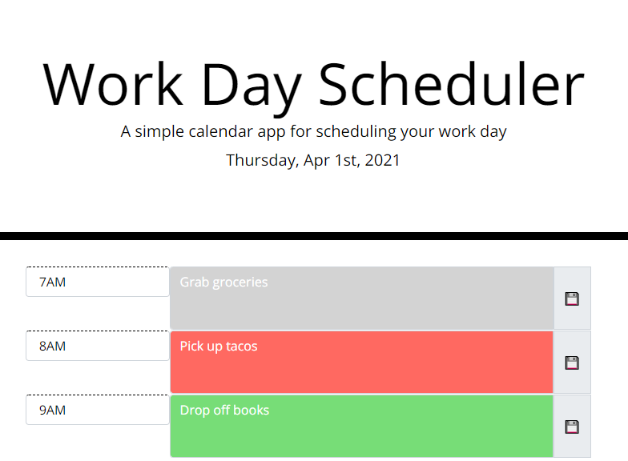

# Daily-To-Do-List

Contents of repo:
* index.html
* style.css
* script.js
* README.md
* Example.PNG

This is a daily to do list tool that tracks your to-dos by hour. 

How to use this tool:
* Each hour will be highlighted a different color:
 * Grey means the hour has passed
 * Red means you need to finish this task before the hour ends
 * Green means you have time to work on those tasks
* Type in to the form boxes and press the save button on the right to record each to-do
 * For this version, any button will save any text in any of the boxes

The repo can be found here: 
[TPR_GitHub](https://github.com/rutherford87/Daily-To-Do-List)

The website can be viewed here: [Daily To-Do List](https://rutherford87.github.io/Daily-To-Do-List/)

Here is a screenshot of the thrilling quiz:

This was challenging but enjoyable. This tool was built with Bootstrap v4.5, JQuery, and Moment.

Good luck, use this tool to get your stuff done!